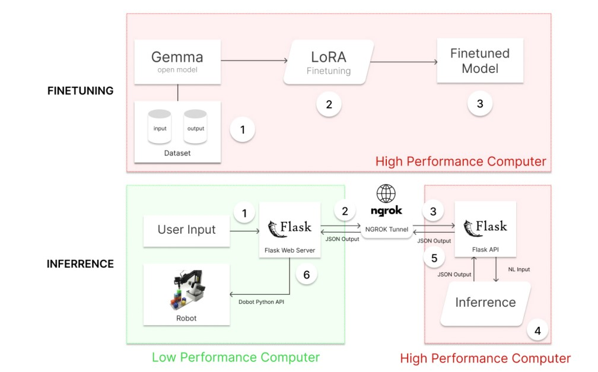
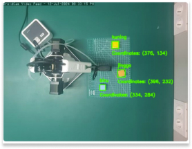
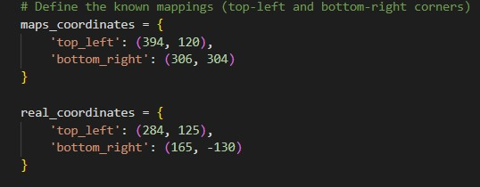
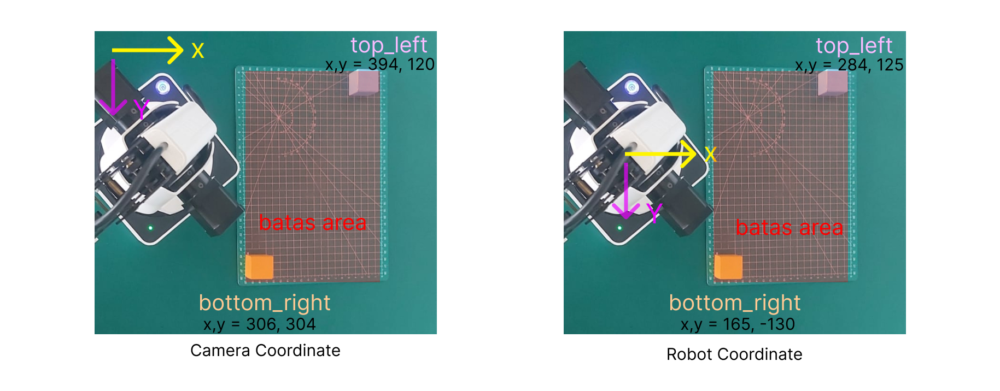
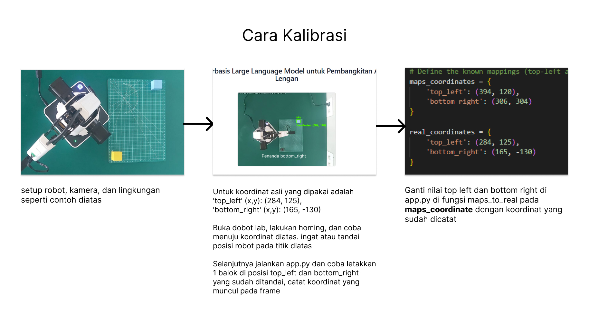
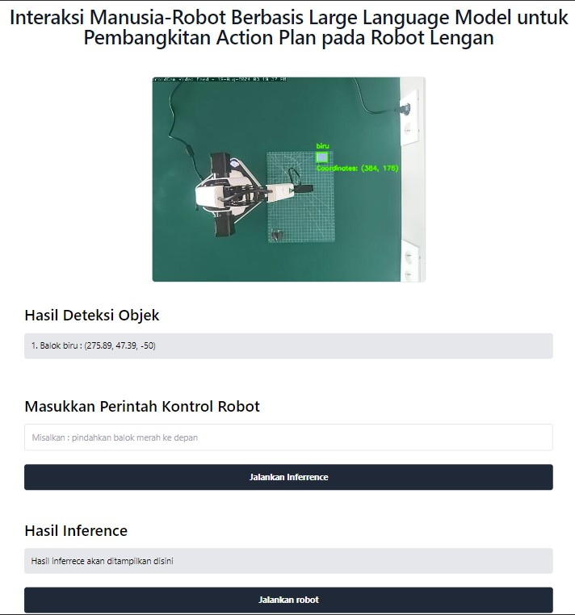
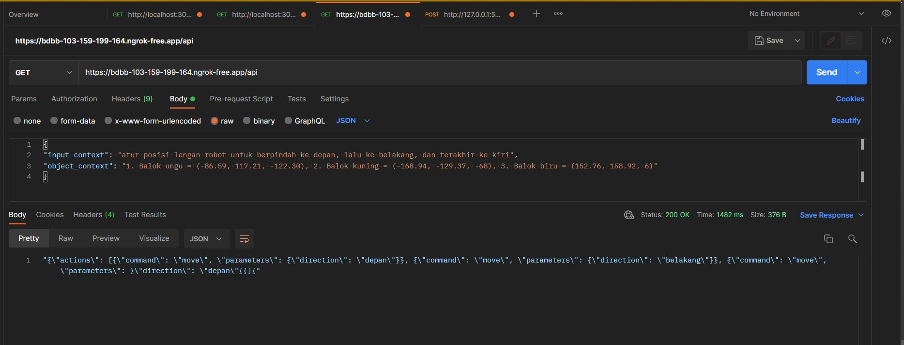
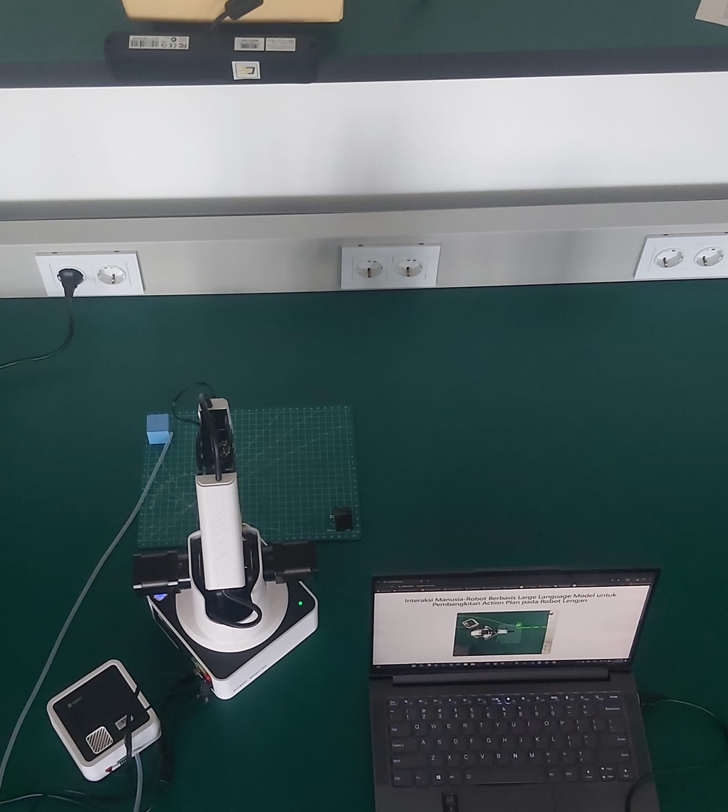
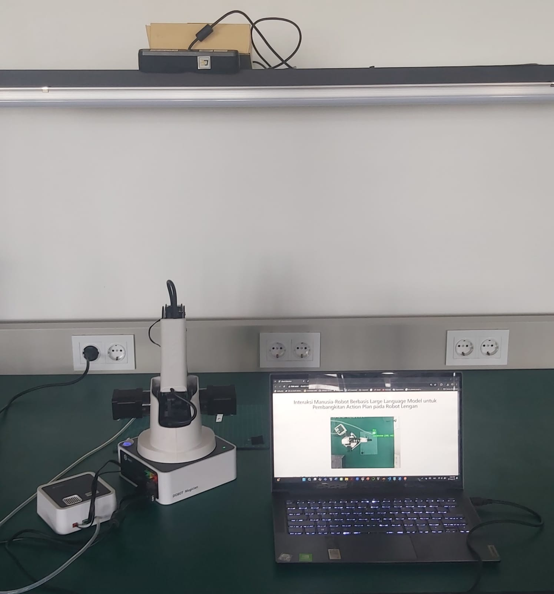
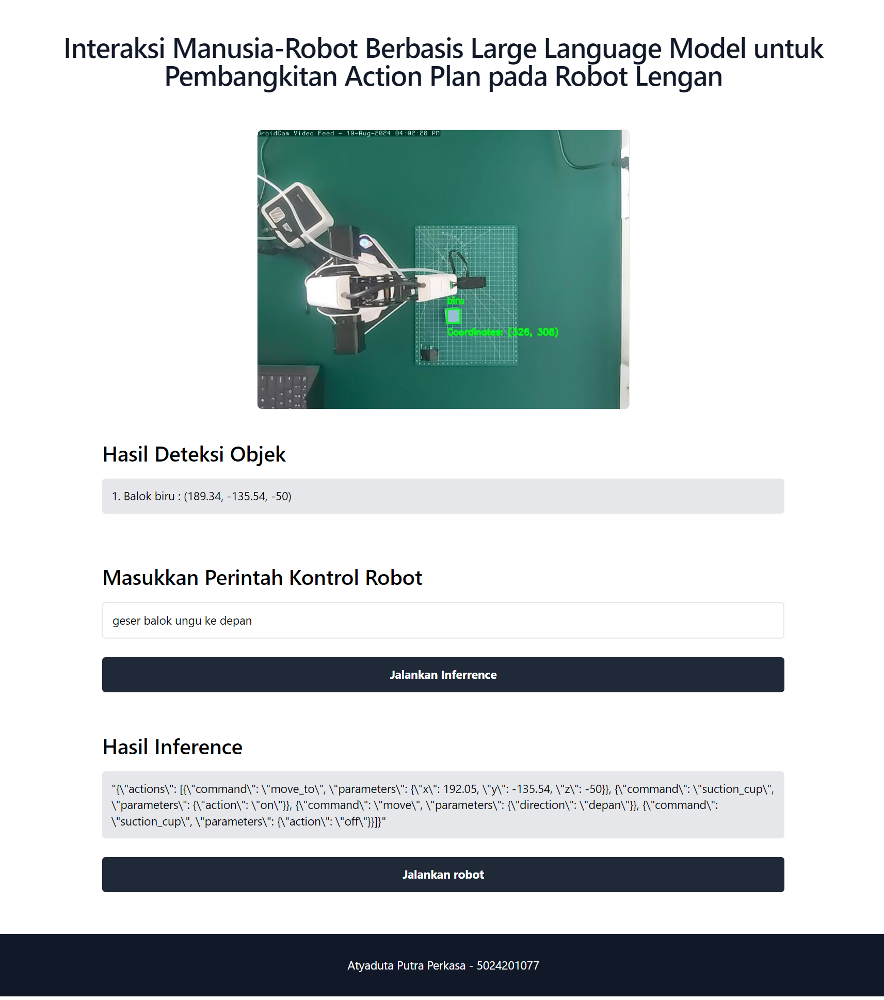

<!-- ABOUT THE PROJECT -->
# Implementasi

Jika anda sudah pada fase ini, diasumsikan telah selesai melakukan finetuning dan model LLM yang baru telah tersedia.

Sebelum melangkah lebih jauh, mari mencoba dulu model yang sudah di finetune.

Berikut notebook sederhana untuk mencoba inferrence (dengan menggunakan LoRA adapter yang telah diupload di Huggingface) [Notebook](./simple-inf.ipynb)

Setelah model LLM selesai di finetune, kita masih ada beberapa tugas sebelum bisa mengimplementasikannya ke robot nyata.

- [x] Finetuning gemma-2B untuk LLM
- [x] Implementasi persepsi robot dengan webcam dan opencv (deteksi objek berdasarkan warna) dan kalibrasi koordinat kamera ke robot
- [x] Membuat web untuk antarmuka robot
- [x] Membuat API Inferrence LLM
- [x] Menghubungkan semuanya

Note: Untuk kode inferrence LLM dan menjalankan robot dijalankan di dua komputer terpisah. Sederhananya Low Performance Computer (LPC) akan terhubung ke robot dan kamera dan juga hosting halaman web sederhana sebagai antarmuka kontrol untuk memasukkan text. Sedaangkan High Performance Computer (HPC) akan digunakan untuk inferrence LLM dan hosting API Inferrence agar LPC dapat membuat HTTP request inferrence ke HPC. Dalam implementasi nyata hanya terdapat dua file kode yang dijalankan (inferrence.ipypnb dan app.py). Jika ingin dijalankan dalam satu komputer (1 HPC), bisa langsung menjalankan dua kode dalam satu komputer. 




Untuk penjelasan selanjutnya asumsikan saya hanya membahas untuk kode app.py kecuali saat membahas pembuatan endpoint untuk inferrence

## Implementasi persepsi robot dengan webcam dan opencv (deteksi objek berdasarkan warna)



Semua kode ini nantinya akan di app.py di fungsi detect_blocks():

Dalam kode ini hanya mendeteksi tepat satu balok biru, jingga, dan kuning.

Untuk deteksi objek dilakukan dengan webcam dan diproses dengan OpenCV untuk klasifikasi berdasarkan warna. Jika ingin menggunakan metode lain, dapat dilakukan. Untuk kamera saya menggunakan ipcam droidcam, jika ingin menggunakan kamera lain, jangan lupa ganti sourcenya.

```
# Function to detect blocks
# Input = Image frame
# Output = frame of detected object (camera with bounding box) and update detected_object global coordinate

def detect_blocks(frame, min_size=100, max_size=5000):
    hsv_frame = cv2.cvtColor(frame, cv2.COLOR_BGR2HSV)
    ......
    ......
    detected_coordinates = detected_objects  # Update global coordinate
    return result_frame
```

Selanjutnya setelah mendapatkan koordinat (misalkan balok merah: (100,200), perlu diingat bahwa koordinat yang didapat adalah koordinat terhadap frame kamera. Sedangkan kita ingin koordinat balok merah terhadap robot. Untuk hal ini saya menggunakan metode interpolasi linear dimana saya menentukan batas titik pojok kiri atas dan pojok kanan bawah dengan fungsi maps_to_real(). Pastikan untuk mengganti koordinat maps_coordinate dengan koordinat kamera baru yang tercatat








## Membuat web untuk antarmuka robot

Untuk website berfungsi sebagai tempat menginput teks input perintah bahasa alami dan menjalankan robot. Website di host dalam flask (app.py).

```
# FOR WEBSITE INTERFACE USING FLASK
@app.route('/')
def index():
    return render_template('index.html')

@app.route('/video_feed')
def video_feed():
    return Response(generate_frames(), mimetype='multipart/x-mixed-replace; boundary=frame')

@app.route('/detected_objects')
def get_detected_objects():
    global detected_coordinates
    return jsonify(detected_coordinates)

# Endpoint to handle running the robot
@app.route('/run-robot', methods=['POST'])
def run_robot_endpoint():
........
........


@app.route('/send_prompt', methods=['POST'])
def send_prompt():
.........
.........


if __name__ == '__main__':
    app.run(debug=True, host='0.0.0.0')
```

Berikut contoh tampilan website



Note: Untuk membuat frame deteksi objek terlihat pada web, pastikan endpoint /video_feed dapat diakses (atur ulang seluruh variabel untuk fungsi terkait generate_frame() dan pastikan kamera terhubung dengan komputer yang akan menjalankan web server app.py)

Untuk cara penggunaan website akan dibahas di akhir.

## Membuat API Inferrence LLM

Untuk bagian ini nantinya akan di inferrence.ipypnb

Untuk API Inferrence LLM dibuat dengan flask. Pada penelitian ini menggunakan reverse proxy NGROK agak API dapat diakses melalu internet. Jika ingin menggunakan jaringan lokal / intranet, skip NGROK dan ganti link request inferrence pada app.py menjadi IP komputer yang digunakan untuk inferrence.

```
# Open a ngrok tunnel to the HTTP server
public_url = ngrok.connect(5000).public_url
print(" * ngrok tunnel \"{}\" -> \"http://127.0.0.1:{}/\"".format(public_url, 5000))

# Update any base URLs to use the public ngrok URL
app.config["BASE_URL"] = public_url

# Define Flask routes
@app.route("/")
def index():
    return "Hello from Inferrence Computer"

@app.route('/api')
def api():
    data = request.json
    input_context = data.get('input_context', None)
    object_context = data.get('object_context', None)
    
    if input_context and object_context:
        output_data = inferrence(input_context, object_context)
        return jsonify(output_data)
    elif input_context is Nonee:
        return jsonify({"status": "failure", "message": "input_context are missing"}), 400
    else:
        return jsonify({"status": "failure", "message": "internal error"}), 400

# Start the Flask server in a new thread
threading.Thread(target=app.run, kwargs={"use_reloader": False}).start()
```

Note: Untuk fungsi inferrence(input_context, object_context) mengambil input perintah (input_context) dan hasil persepsi deteksi objek (object_context) dan dijalankan selnya sebelum flask. Untuk mencoba gunakan aplikasi seperti POSTMAN untuk membuat request ke API dan pastikan dapat mengembalikan rencana aksi JSON yang sesuai.



## Menghubungkan semuanya

Untuk setup di penelitian ini dibagi menjadi 2, yaitu setup inferrence LLM dan setup robot.

### Setup inferennce

Jalankan inferrence.ipypnb di HPC dan pastikan endpoint /api dapat diakses dengan membuat request (gunakan aplikasi seperti POSTMAN) untuk mengecek apakah api dapat mengembalikan hasil inferrence.

### Setup robot

Selnajutnya di LPC terdapat beberapa step

1. Coba install [dobotlab](https://www.dobot-robots.com/service/download-center). Dobotlab meruapakan GUI untuk mengontrol Dobot Magician. Aplikasi ini diperlukan untuk mengecek port mana DOBOT terhubung (misal 'COM3') dan berguna kedepannya untuk mengeksplor fungsionalitas robot ini.
2. Selanjutnya install library berikut ini library yang digunakan (disarankan menggunakan venv/conda agar tidak menggangu library lain)

```
from flask import Flask, Response, render_template, jsonify, request
import cv2
import numpy as np
import requests
import pydobot
import json
```

Library utama yang digunakan untuk mengontrol robot adalah [pydobot](https://github.com/luismesas/pydobot). Baca reponya terlebih dahulu untuk mengetahui dokumentasinya.

Setelah menginstal seluruh library, buka folder libary dimana pydobot diinstal. Selanjutnya ganti isi dobot.py dengan file [dobot.py](./dobot.py) di repo ini.

Sekarang coba untuk jalankan fungsi tes_koneksi.py untuk melihat apakah library robot terinstal dengan benar. Jika terdapat error pastikan port (misal COM8) sudah benar, robot sudah menyala dan terhubung via USB, dan coba untuk run kode setelah robot berbunyi beep (karena robot akan inisiasi pada awal dihidupkan). 

Jika robot tidak merespon atau terdapat pesan error di CLI, coba untuk homing manual dengan menggunakan dobotlab. Selanjutnya disconnect dobot dari dobotlab (JANGAN MATIKAN / CABUT USB ROBOT !!!) dan coba kembali jalankan kode.

Jika tes_koneksi.py sudah berjalan dengan lancar, selanjutnya hubungkan kamera dan robot dengan komputer LPC dengan konfigurasi berikut.





Setelah itu coba jalankan app.py dan inferrence.ipypnb. Pada website yang dihost app.py coba akses endpoint / atau index.html. Seharusnya menghasilkan tampilan berikut:



Untuk menggunakan website
1. Masukkan input perintah bahasa alami ke kolom teks "misalkan geser balok kuning kedepan".
2. Klik jalankan inferrece dan tunggu sampai rencana aksi dalam bentuk JSON muncul.
3. Jika hasil inferrence dalam bentuk JSON muncul dan tidak terdapat error, klik jalankan robot (pastikan untuk tetap mengawasi kondisi robot).

Note : jika koordinat mulai melenceng / tidak akurat, coba lakukan homing dengan kode tes_koneksi.py


